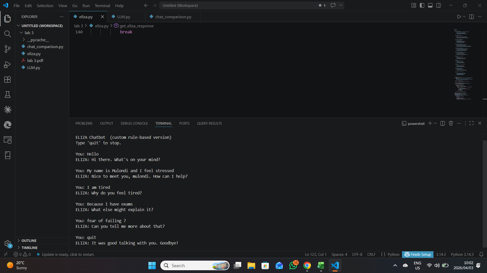
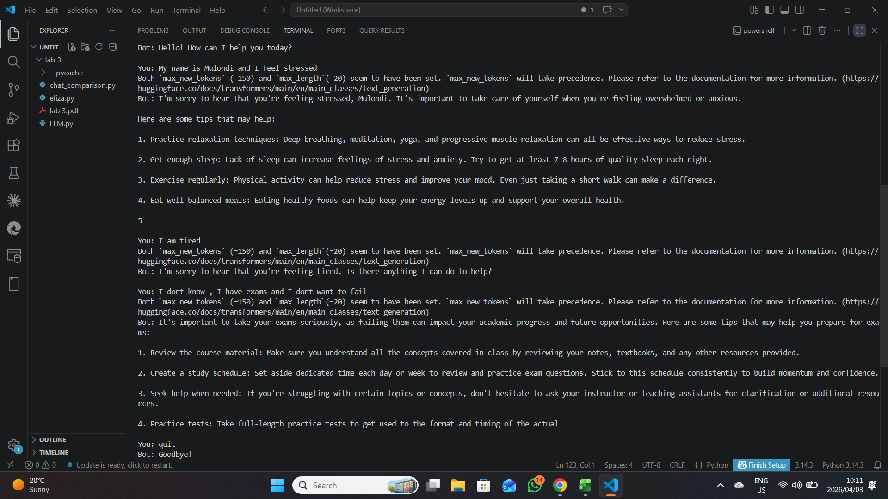
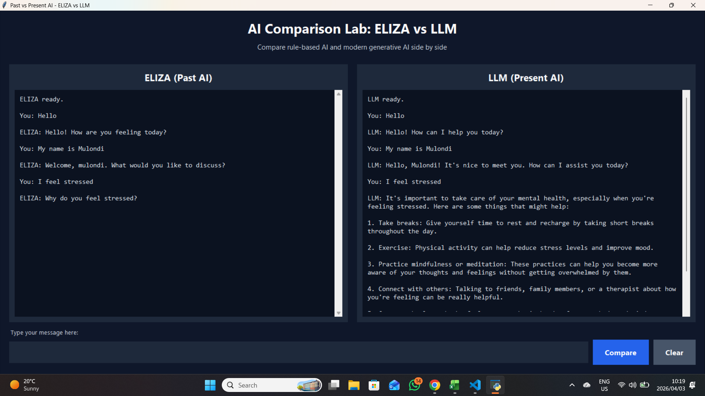

# AI Chatbot Comparison: ELIZA vs Modern LLM

A professional Natural Language Processing and Artificial Intelligence project comparing a classic rule-based chatbot with a modern transformer-based language model. The project highlights the evolution from transparent pattern-matching systems to neural generative AI through a side-by-side Python GUI.

## Project Overview

This project compares two different approaches to conversational AI:

- ELIZA-style rule-based chatbot using handcrafted pattern-matching rules
- Modern Large Language Model chatbot using Hugging Face Transformers
- Side-by-side graphical interface for direct response comparison
- Qualitative analysis of explainability, fluency, speed, and context handling

The goal is to demonstrate how chatbot design has evolved from deterministic rules to modern generative models.

## Repository Structure

```text
ai-chatbot-comparison-eliza-vs-llm/
+-- assets/
¦   +-- screenshots/
¦       +-- chatbot-comparison-1.png
¦       +-- chatbot-comparison-2.png
¦       +-- chatbot-comparison-3.png
+-- src/
¦   +-- eliza.py
¦   +-- llm_chatbot.py
¦   +-- chat_comparison_gui.py
+-- requirements.txt
+-- .gitignore
+-- README.md
```

## Technologies Used

- Python
- Tkinter
- Hugging Face Transformers
- PyTorch
- Qwen2.5-1.5B-Instruct
- Rule-based NLP
- Generative AI

## Installation

Clone the repository and install dependencies.

```bash
git clone https://github.com/mulondimbodi/ai-chatbot-comparison-eliza-vs-llm.git
cd ai-chatbot-comparison-eliza-vs-llm
pip install -r requirements.txt
```

The first LLM run may download the model from Hugging Face, which can require significant bandwidth and disk space.

## Usage

### Run the ELIZA chatbot only

```bash
python src/eliza.py
```

### Run the LLM chatbot only

```bash
python src/llm_chatbot.py
```

### Run the side-by-side comparison GUI

```bash
python src/chat_comparison_gui.py
```

## Comparison Focus

| Aspect | ELIZA | Modern LLM |
| --- | --- | --- |
| Technique | Rule-based pattern matching | Transformer-based text generation |
| Explainability | High | Lower |
| Context handling | Limited | Stronger short-form context handling |
| Response style | Predictable and structured | Fluent and varied |
| Resource usage | Very lightweight | Requires model download and inference resources |
| Failure mode | Generic fallback responses | May hallucinate or drift from the prompt |

## Results

### Chatbot comparison screenshot 1



### Chatbot comparison screenshot 2



### Chatbot comparison screenshot 3



## AI and Data Science Relevance

This project demonstrates practical AI and NLP skills including:

- Implementing rule-based natural language processing
- Using transformer-based language models through Hugging Face
- Comparing symbolic AI with modern generative AI
- Building an interactive Python GUI for model evaluation
- Communicating qualitative model behavior through examples
- Understanding trade-offs between explainability, fluency, and computational cost

## Future Improvements

- Add response time benchmarking for both systems
- Save conversation logs for analysis
- Add sentiment analysis on user prompts and chatbot responses
- Compare multiple open-source LLMs
- Add evaluation metrics for relevance, coherence, and latency
- Package the application as a desktop executable

## Author

Created by Mulondi Mbodi as part of a professional Artificial Intelligence, NLP, and Data Science portfolio.
